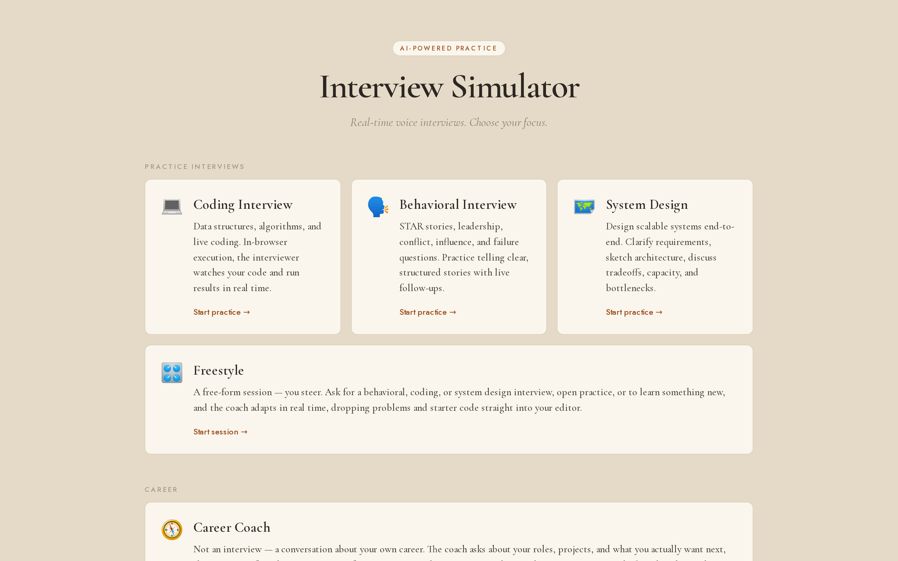
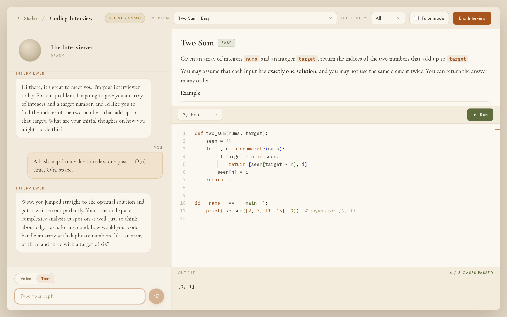
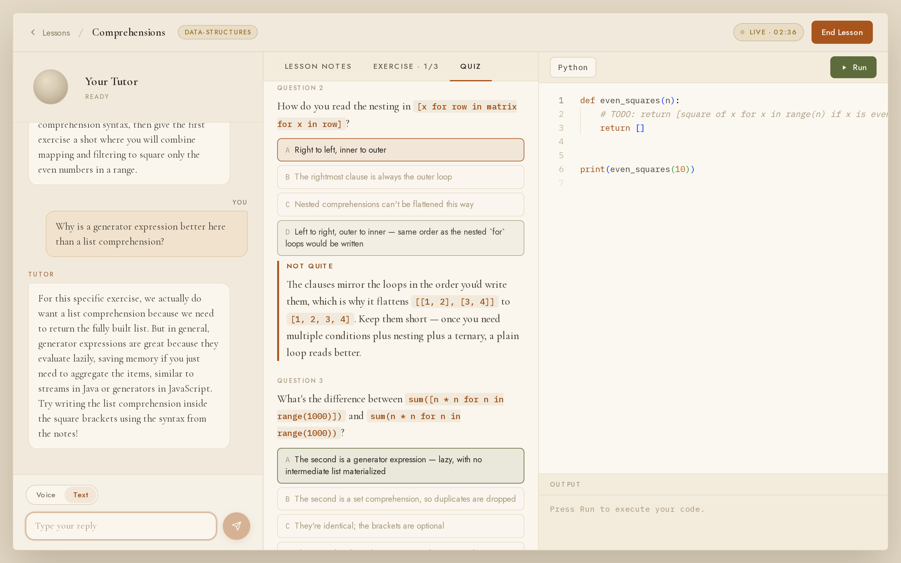
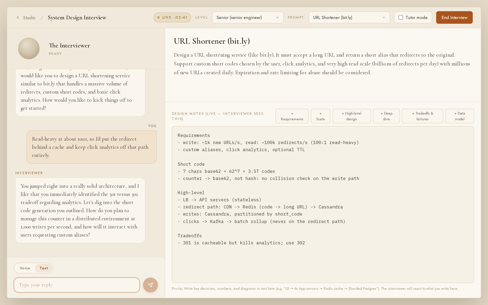

# interview-sim

AI powered interview simulation for software engineers. Includes real-time voice interaction as well as a text only option. It features a practice "tutor" mode and an interview simulation mode. Coding interviews share code editor context with AI interview agent enhancing life-like simulation.

Requires an OpenRouter account.

**What's in it:**

| Route | What it does |
|---|---|
| `/coding` | Coding interviews with a real editor. Solutions are graded against test cases, not eyeballed. |
| `/behavioral` | Behavioral interviews, plus a STAR-coaching tutor mode. |
| `/system-design` | System design interviews against a scored rubric. |
| `/learn` | Guided courses taught by a voice tutor — Python, TypeScript, Go, Data Structures & Algorithms, Recursion, React, Distributed Systems, AWS, and Applied AI. |
| `/library` | A browsable system design concept library. |
| `/freestyle` | An open session you steer; the coach picks the track and can load code into your editor. |
| `/career` | A career conversation that ends with a draft resume and a job-search plan. |
| `/history` | Past graded scorecards, stored on-device. |

## What it looks like

Every session runs on voice by default; the screenshots below are in text mode so the
conversation is legible.



A coding interview. The interviewer sees your editor, and **Run** grades the solution
against the problem's test cases rather than printing stdout for you to eyeball.



A `/learn` lesson. Notes, a runnable exercise, and an end-of-lesson quiz sit in tabs
beside the tutor — and anything you miss on the quiz is handed to the tutor, so you can
ask them to work through it.



A system design interview. Your notes are live: the interviewer reads what you type and
questions it.



## Prerequisites

- **Node.js 20.9+** (Next.js 16 requires it)
- An **[OpenRouter](https://openrouter.ai)** account with credit

## Environment

The app needs exactly one environment variable. Create a `.env.local` in the repo root:

```bash
OPENROUTER_API_KEY=sk-or-v1-...
```

Get the key from [openrouter.ai/keys](https://openrouter.ai/keys). `.env*` is gitignored, so this file stays local.

That single key pays for all three model calls the voice loop makes on every turn — speech-to-text, chat, and text-to-speech (see `src/lib/openrouter.ts` for the models in use). Without it, the app builds and renders fine but every session fails on the first turn with a 401 from OpenRouter.

## Running it

```bash
npm install
npm run dev
```

Then open [http://localhost:3000](http://localhost:3000).

**Grant microphone access when the browser asks** — the whole app is voice-first. The mic is push-to-talk: it only captures while you hold the button, so nothing is recorded until you arm it. Every session also accepts typed input if you'd rather not talk.

Note that browsers only allow microphone access over HTTPS or on `localhost`. Hitting the dev server by LAN IP from another device will load the page but silently fail to record.

## Scripts

```bash
npm run dev         # dev server
npm run build       # production build
npm start           # serve the production build
npm run lint        # eslint
npm test            # vitest, single run
npm run test:watch  # vitest, watch mode
```

CI runs `npm run lint && npm run build && npm test`. Running those three locally is the same gate.

## Adding content

Most content lives in typed banks under `src/lib/`, each with tests that enforce their invariants:

- **`problems/`** — coding problems, with `TestSpec` cases the grader runs.
- **`lessons/`** — `/learn` courses. Each course is a folder with one file per module, registered in `lessons/index.ts`. A course with a `language` gets an editor and exercises; a *concept* course declares none and is conversational only (its tutor persona is keyed by course id in `prompts.ts`).
- **`library/`** — system design articles.
- **`questions/`** — behavioral and system design prompts.

`prompts.ts` holds every system prompt, kickoff turn, and assessment rubric.
